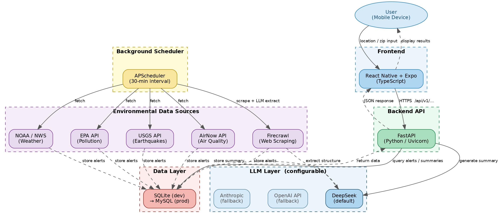

# RiskRadar — Tech Stack Reference (Source of Truth)

**Version:** Post-Meeting Final · March 3, 2026
**Source:** Security Questionnaires (Feb–Mar 2026) — Noah Benoit, Max Compeaux, Rebecca Gautreaux, Celeste George, Qui Huynh, Ben Manuel | Main branch source code | In-person meeting corrections (3/2/26)

---

## Tech Stack Flowchart

**Flowchart Summary:** The user's mobile device communicates with a React Native + Expo (TypeScript) frontend, which sends HTTPS requests to a FastAPI backend (Python/Uvicorn). The backend queries the SQLite database (dev) / MySQL (production) for stored alerts and summaries, and calls the LLM layer to generate location-based risk summaries. Separately, APScheduler runs on a 30-minute interval, pulling data from NOAA/NWS (weather), AirNow (air quality), EPA (pollution), USGS (earthquakes), and Firecrawl (web scraping with LLM-assisted extraction). All fetched data is stored back into the database. DeepSeek (`deepseek-chat`) is the default LLM; OpenAI and Anthropic are configured as fallbacks. NASA FIRMS (wildfire) is currently in the codebase but may be removed.

---

## Confirmed Tech Stack

### Platform

Cross-platform mobile application targeting iOS and Android. Delivered via React Native with Expo managed workflow. Web output is also configured (static export) but is not the primary target.

### Frontend

| Component | Confirmed Value |
|---|---|
| Framework | React Native 0.81.5 |
| Build toolchain | Expo ~54.0.33 (managed workflow) |
| Language | TypeScript ~5.9.2 |
| Routing | expo-router ~6.0.23 |
| Navigation | @react-navigation/native, @react-navigation/bottom-tabs |
| Animations | react-native-reanimated ~4.1.1 |
| Runtime (dev) | Node.js (for React Native Metro bundler) |
| Testing device | Android SDK (running in VM) |
| New Architecture | Enabled (`newArchEnabled: true`) |

### Backend

| Component | Confirmed Value |
|---|---|
| Framework | FastAPI |
| Server | Uvicorn (ASGI) |
| Language | Python |
| Background scheduler | APScheduler — 30-minute scrape interval |
| Password hashing | SHA-256 (current) — see security notes |
| Auth mechanism | JWT (JSON Web Tokens) |
| Message queue | Not implemented — RabbitMQ under consideration, currently localized |

### Database

| Environment | Database |
|---|---|
| Development | SQLite |
| Production (target) | MySQL |
| ORM | SQLAlchemy (facilitates the SQLite → MySQL migration path) |
| Schema | 13-table MariaDB-compatible schema (see `docs/DATA_MODEL.md`) |

> **Meeting confirmation (3/2/26):** "We are going to be using MySQL instead of SQLite." SQLite is dev-only and temporary.

### LLM Layer
